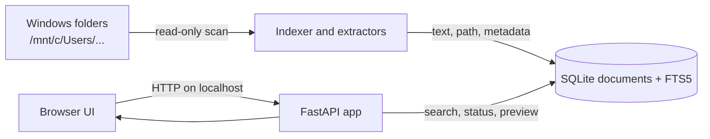

# Architecture

Xtoo is a single-process FastAPI application with a background indexer and a
SQLite database. The browser and server run on the same WSL installation.

| Component | Responsibility |
| --- | --- |
| `xtoo/cli.py` | `init`, `index`, and `serve` commands; private file permissions |
| `xtoo/config.py` | TOML loading, validation, XDG paths, nested-root de-duplication |
| `xtoo/indexer.py` | Incremental traversal, extraction, stale/deleted-file handling |
| `xtoo/extract.py` | Extension groups and text extraction; scripts are read, never executed |
| `xtoo/store.py` | SQLite schema, FTS5 index, searches, previews, metadata |
| `xtoo/web.py` | Local API, static UI, host/CSP/security headers |
| `xtoo/static/` | Search UI, filters, preview, refresh, responsive layout |

`xtoo serve` starts Uvicorn on `127.0.0.1:8765` and a background scan thread.
The index is `~/.local/share/xtoo/index.sqlite3` by default, with SQLite WAL
sidecars. Source files are never rewritten. Missing roots retain cached rows and
report an error; successful traversals remove rows for deleted files.

The current release has no network connectors, authentication, or remote AI
service. Runtime dependencies are FastAPI, Uvicorn, pypdf, python-docx,
openpyxl, python-pptx, and `tomli` on Python <3.11.
