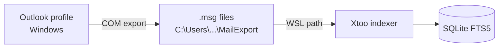

# Email indexing

Xtoo cannot talk to Outlook. WSL has no MAPI access, and the Microsoft 365 API
connector described in the README is not implemented. Email is indexed in two
stages instead:



The export runs on Windows on your schedule; Xtoo treats the exported files as
ordinary documents. Nothing is deleted from the mailbox, and no credentials are
stored by Xtoo.

## Supported message files

| Extension | Source | Parser |
| --- | --- | --- |
| `.msg` | Outlook **Save As**, drag to a folder, or `scripts/Export-OutlookMail.ps1` | `xtoo/mail.py` with `olefile` |
| `.eml` | Most other mail clients, and Outlook on the web **Download** | Python's standard `email` module |

Both produce the same indexed text: a `Subject`, `From`, `To`, `Cc`, and `Date`
header block, an `Attachments` line listing attachment filenames, then the message
body. HTML bodies are reduced to text, and `<script>` and `<style>` content is
dropped. Sender addresses, recipient names, and attachment filenames are all
searchable.

> [!NOTE]
> Attachment *filenames* are indexed; attachment *contents* are not. An
> attachment is never opened, decoded, or executed. To search inside attachments,
> save them as files into an indexed folder.

## Using an export you already have

Any directory tree of `.msg` or `.eml` files works, whatever produced it and
however its files are named. Xtoo recurses into subdirectories, so pointing
`folders` at the top of an existing export indexes every folder beneath it. A
tree exported by another tool needs no conversion and no renaming.

To find where such an export stops, so a top-up does not re-export what you
already have:

```bash
python scripts/mail_coverage.py /mnt/c/Users/YOU/Documents/Outlook_MSG_Export
```

```text
folder                       messages    earliest      latest  unreadable
mailbox_-_Inbox                  4821  2024-03-04  2025-08-14           2
mailbox_-_Inbox_-_Projects      19044  2023-11-02  2025-07-29
```

Each Outlook folder is usually exported into its own directory and stops at its
own date, which is why the report is per directory rather than a single figure.
Use a folder's `latest` date as `-Since` when topping it up:

```powershell
.\Export-OutlookMail.ps1 -FolderPath 'Inbox\Projects' -Since '2025-07-29' -Destination 'C:\Users\YOU\Documents\MailExport'
```

Export the top-up to a **new** destination rather than back into the old tree.
The two naming schemes cannot recognise each other, so keeping them apart makes
the boundary obvious; both directories can be indexed at once. Expect a few
duplicated messages from the boundary day itself, since `-Since` is inclusive.

## Step 1: export from Outlook

Run in Windows PowerShell, not in WSL. Outlook must be installed and signed in;
the script drives the running profile through COM.

```powershell
cd \\wsl$\Ubuntu\home\YOUR_USER\xtoo\scripts
.\Export-OutlookMail.ps1
```

That picks a folder interactively and exports the last 90 days to
`Documents\MailExport\<folder>`. For an unattended run:

```powershell
.\Export-OutlookMail.ps1 -FolderPath 'Inbox\Projects' -Days 30 `
  -Destination 'C:\Users\YOUR_USER\Documents\MailExport' -IncludeSubfolders
```

| Parameter | Default | Behavior |
| --- | --- | --- |
| `-FolderPath` | interactive picker | Path from the mailbox root, such as `Inbox\Projects` or `Sent Items`. |
| `-Destination` | `Documents\MailExport` | Parent directory for exported messages. |
| `-Days` | `90` | Only messages received in the last N days; `0` exports the whole folder. |
| `-IncludeSubfolders` | off | Also exports child folders into matching subdirectories. |

Filenames are `<timestamp>_<subject>_<id>.msg`, where the id is derived from the
Outlook entry ID. Re-running the script therefore skips messages already on disk
and reports them as *already present*, so it is safe to schedule. Non-mail items
such as meeting requests and calendar entries are skipped.

If PowerShell refuses to run the file, either unblock it
(`Unblock-File .\Export-OutlookMail.ps1`) or start it with
`powershell -ExecutionPolicy Bypass -File .\Export-OutlookMail.ps1`. Ask your IT
department first if macro or script policy is managed centrally.

## Step 2: index the export

Add the export directory to `~/.config/xtoo/config.toml` as a WSL path:

```toml
folders = [
  "/mnt/c/Users/YOUR_WINDOWS_USER/Documents",
  "/mnt/c/Users/YOUR_WINDOWS_USER/Documents/MailExport",
]
max_file_mb = 50
```

`max_file_mb` matters more for mail than for documents: attachments are embedded
in the `.msg`, so a message with a 30 MB attachment is skipped whole under the
25 MB default. Raise the limit or export folders with large attachments
separately.

Then rescan and confirm:

```bash
xtoo index
curl 'http://localhost:8765/api/status'   # "kinds" should list msg or eml
```

## Keeping the export current

Repeat runs are incremental, so a scheduled task is the usual approach. In Task
Scheduler, create a task that runs at logon and every few hours:

- Program: `powershell.exe`
- Arguments: `-NoProfile -ExecutionPolicy Bypass -File "C:\path\to\Export-OutlookMail.ps1" -FolderPath "Inbox" -Days 7 -Destination "C:\Users\YOUR_USER\Documents\MailExport"`

Use a small `-Days` window for frequent runs; messages already exported are
skipped cheaply.

## Limitations

| Limitation | Detail |
| --- | --- |
| Deletions are not mirrored | A message deleted in Outlook keeps its exported file, and stays searchable, until you delete the file. |
| Mixed exports can overlap | Topping up from a date already covered exports those messages again under a different name, and they then appear twice in results. |
| Moves create a second copy | Exporting the same message from two folders writes two files, because the Outlook entry ID differs per folder. |
| RTF-only bodies | A `.msg` with neither a plain-text nor an HTML body indexes headers only. Outlook has written HTML bodies by default for many years, so this affects mostly old messages. |
| Attachment contents | Indexed by filename only. |
| Encrypted or rights-protected mail | The body is not readable by the parser and indexes as headers only. |
| Embedded messages | A forwarded `.msg` attached to another message is not expanded. |

## Data protection

Exported mail is a full copy of message content sitting in a normal Windows
folder, and its text is copied again into the Xtoo index. Both are unencrypted
by Xtoo. Confirm with your IT or security team that local mail export and
indexing are permitted before exporting work email, and see
[Security](security.md).
